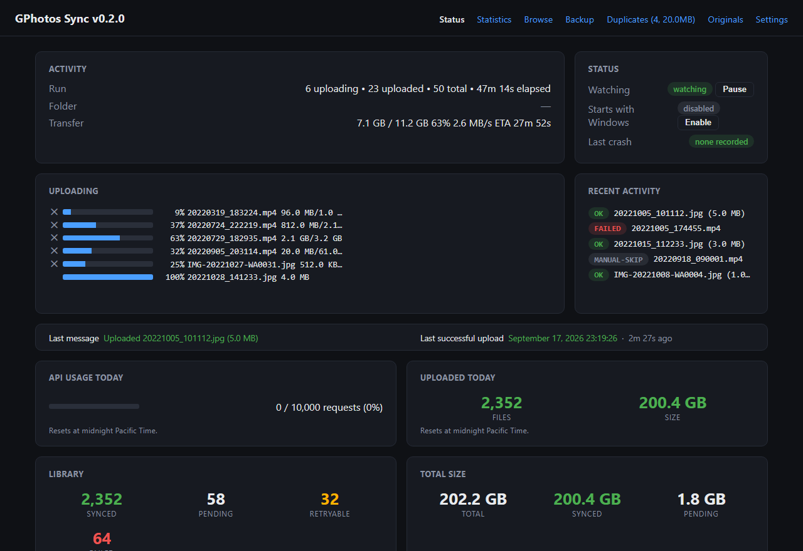
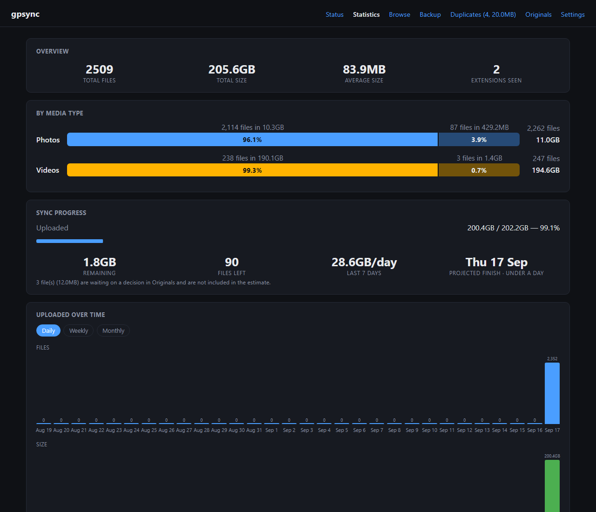
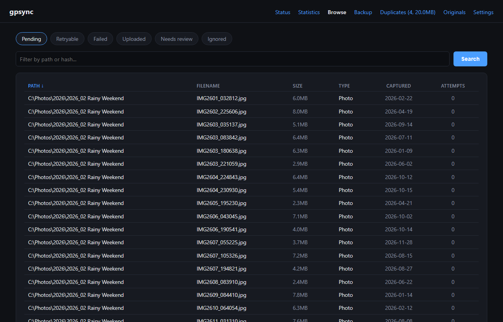
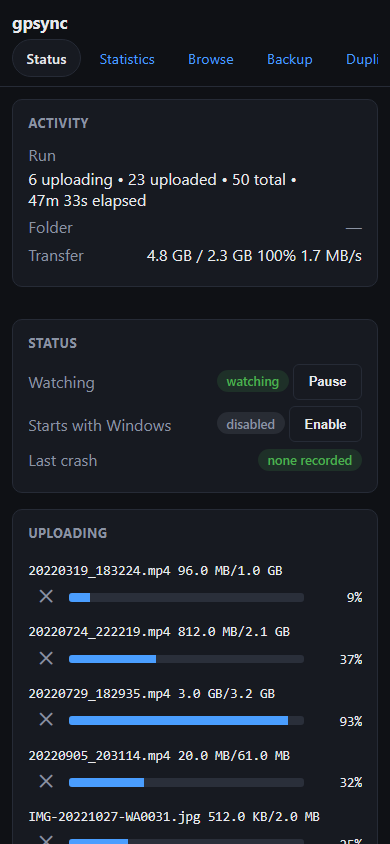

# GPhotos Sync

Sync local photo and video folders to Google Photos, from the command line or
a Windows tray app — with a ledger that knows exactly what has been uploaded,
so nothing is sent twice and nothing is quietly missed.

[](https://github.com/gmizrahi/gpsync/actions/workflows/ci.yml)
[](LICENSE)

> **Not affiliated with Google.** Google and Google Photos are trademarks of
> Google LLC. gpsync is an independent tool that talks to the public Google
> Photos API using credentials you create yourself.

## Why this exists

Google Drive for desktop no longer backs up to Google Photos, on Windows or
macOS, and there has never been a Drive client for Linux at all.

What Google offers instead is uploading through the Google Photos website:
you open photos.google.com, pick folders, and leave the tab open. It is slow,
it stops when the browser is closed or the machine sleeps, it gives no useful
account of what finished or failed, and it is not a background agent in any
sense. For a library of tens of thousands of files that is not a workflow.

The other common answer is an ad-hoc `rclone copy`, which works until you ask
the questions that matter: *did that folder finish? what failed? what is left?
did I already upload this file under a different name?*

gpsync answers those. Every file is identified by its **content hash**, so a
photo is uploaded once no matter how often it is renamed, moved or copied.
Everything else — retries, Google's throttling, the daily quota, files you
deleted on disk — is tracked in a local SQLite ledger you can query.

## What it looks like

The tray app and `gpsync dashboard` serve the same web dashboard: live
progress, statistics, and browsing of everything the ledger knows about.



<details>
<summary>More screenshots — statistics, browsing, and the phone layout</summary>

Statistics: what is in the library, and what throttling has cost.



Browse: every file the ledger tracks, filterable by status, path or hash.



The dashboard is laid out for phones as well as desktop:



</details>

> These screenshots are generated from a synthetic ledger
> (`cmd/demo-ledger`), never from a real photo library.

## Features

- **Content-hash deduplication.** Rename, move or duplicate a file locally and
  gpsync still knows it is already in Google Photos.
- **Quota- and throttle-aware uploads.** A circuit breaker backs off when
  Google throttles, resumes on its own, and never spins through a daily quota.
- **Deleted and moved files are tracked.** A moved file is repointed; a deleted
  one is confirmed missing only after a full pass proves it is gone, never on
  a single scan.
- **Windows tray app with a web dashboard.** Live progress, statistics,
  browsing, duplicate and originals review — on desktop and phone.
- **Continuous or one-shot.** `gpsync watch` uploads as files appear;
  `gpsync sync` works through a library folder by folder.
- **Review tools.** Duplicate resolver, "originals" folder review, pre-import
  checks, capture-date repair.
- **Backs up its own state** — the ledger, settings and credentials — and can
  restore them.
- **No telemetry, no servers, no accounts.** See [PRIVACY.md](PRIVACY.md).

## Install

**Windows** — download `gpsync-setup.exe` from the
[latest release](https://github.com/gmizrahi/gpsync/releases/latest); it
installs the CLI and the tray app and puts `gpsync` on your PATH. A plain zip
is published alongside it if you prefer no installer.

**Linux and macOS** — download the tarball for your platform from the same
release page, put `gpsync` on your PATH, and (optionally) run it in the
background with the bundled systemd unit or launchd agent: see
[docs/running-as-a-service.md](docs/running-as-a-service.md). The CLI and the
web dashboard work the same everywhere; only the tray app is Windows-only.

**From source** (any platform for the CLI; the tray app is Windows-only):

```sh
go install github.com/gmizrahi/gpsync/cmd/gpsync@latest
```

## Quick start

```sh
gpsync setup                     # connect a Google account (see docs/setup.md)
gpsync sync "C:\Photos\2026"     # scan and upload one folder
gpsync info                      # what is synced, pending and failed
```

Then let it run continuously — `gpsync watch`, or start the tray app and open
its dashboard at <http://127.0.0.1:10924>.

The first step is the only fiddly one: Google requires each user to create
their own API credentials. [docs/setup.md](docs/setup.md) walks through it,
and `gpsync setup` can import an existing rclone remote instead.

## Commands

| Command | What it does |
|---------|--------------|
| `setup`, `import-rclone` | Connect a Google account |
| `scan`, `sync`, `upload` | Find files, upload them |
| `watch`, `dashboard` | Run continuously, with or without the web UI |
| `info`, `pending`, `log`, `extensions` | What is in the ledger |
| `recheck`, `doctor`, `verify` | Check and repair ledger state |
| `duplicates`, `precheck`, `originals-uploaded`, `clean-originals` | Find and resolve redundant copies |
| `mark-synced`, `quality`, `reupload`, `fix-dates` | Correct what the ledger records |
| `backup`, `restore` | Snapshot and restore gpsync's own data |
| `quota`, `throttle-log` | API usage and throttling history |

Every command has `--help` with examples. Full reference:
[docs/commands.md](docs/commands.md).

## Documentation

- [Setup](docs/setup.md) — creating Google credentials, step by step
- [Configuration](docs/configuration.md) — every `config.toml` setting
- [Commands](docs/commands.md) — full command reference
- [Dashboard](docs/dashboard.md) — the tray app and web UI
- [Troubleshooting](docs/troubleshooting.md) — throttling, quota, stuck files
- [Limitations](docs/limitations.md) — what the Google Photos API cannot do
- [Security](SECURITY.md) · [Privacy](PRIVACY.md)

## Limitations worth knowing up front

Google's API is append-only for third-party tools. gpsync **cannot delete**
anything from your library, and cannot read back photos it did not upload.
Album support was removed because the API rejects the very media IDs it just
issued. Details and evidence: [docs/limitations.md](docs/limitations.md).

## Building

```sh
make check   # vet, test, build
make dist    # Windows binaries into dist/
```

Requires Go 1.26 or newer. No cgo, so the Windows binaries cross-compile from
any host.

## Contributing

Issues and pull requests are welcome — see [CONTRIBUTING.md](CONTRIBUTING.md).

## License

MIT — see [LICENSE](LICENSE). Third-party licenses are listed in
[THIRD_PARTY.md](THIRD_PARTY.md).
